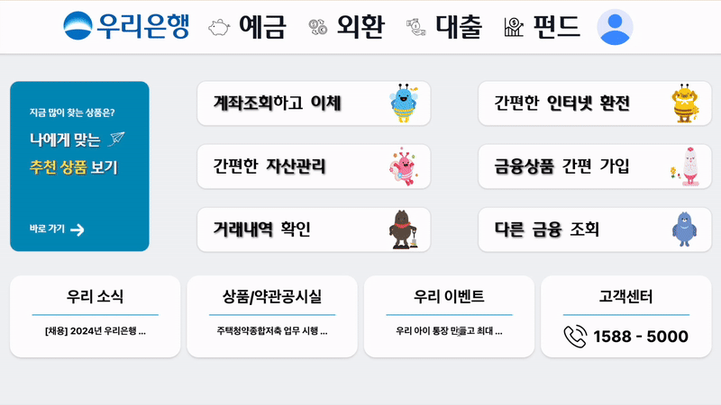
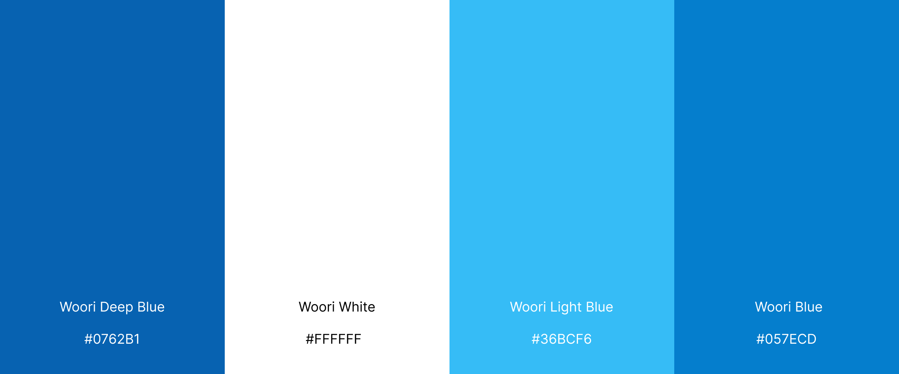
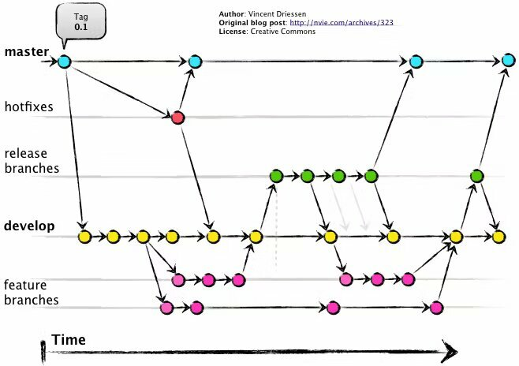

# 👴👵고령자를 위한 금융 상품 추천 서비스💸

<br>

## 🧐 기획 의도

고령화 사회에 맞춰 고령자용 은행 서비스는 점차 늘어나고 있지만, 여전히 여러 가지 문제점이 존재하며 다음과 같은 공통된 문제점이 있습니다:

### ✅ 사용자 맞춤화 부족

고령자들이 각기 다른 신체적, 정신적 특성을 가지므로, 모든 사용자를 동일하게 대하는 접근법은 효과적이지 않습니다. 예를 들어, 일부 고령자는 큰 글씨를 원하지만, 다른 이들은 간단한 텍스트 설명이나 음성 안내를 선호할 수 있습니다.

### ✅ 직관성 결여

웹 페이지의 디자인이나 내비게이션이 직관적이지 않아 고령자들이 원하는 서비스를 쉽게 찾지 못하거나, 어려운 언어와 복잡한 메뉴에 의해 이용을 망설이게 됩니다.

### ✅ 기술적 장벽

스마트폰이나 컴퓨터 사용에 익숙하지 않은 고령자들이 다양한 화면 크기와 기능에 적응하기 어렵습니다. 또한, 불편한 UI/UX는 웹 서비스를 이용하는 데 큰 장애물이 됩니다.

이러한 이유로 저희는 `**노인 친화 금융 상품 추천 서비스**` 를 개발하기로 하였습니다.

<br>

## 시연 영상



## :technologist: Team

|                                                               **남승현**                                                               |                                                                **노영재**                                                                 |                                                               **서용준**                                                               |                                                                   **이정민**                                                                    |
| :------------------------------------------------------------------------------------------------------------------------------------: | :---------------------------------------------------------------------------------------------------------------------------------------: | :------------------------------------------------------------------------------------------------------------------------------------: | :---------------------------------------------------------------------------------------------------------------------------------------------: |
| [ <br/> @namsh1125](https://github.com/namsh1125) | [ <br/> @YoungjaeRo](https://github.com/YoungjaeRo) | [ <br/> @mango0422](https://github.com/mango0422) | [ <br/> @jeongmin07262](https://github.com/jeongmin07262) |

<br>

## UI 스타일 가이드라인

1. 폰트

   - [우리다움체](https://www.woorifg.com/kor/company/ci/font/contentsid/581/index.do)

2. 컬러 배색

   

3. 여백
   - 들여쓰기: 4space
   - 코드 그룹 간 1줄씩 빈 줄

## :triangular_flag_on_post: Convention

### File

1. 폴더 구조

   - css는 tailwindcss를 사용하며, [styles](./src/styles)를 사용한다.
   - 이미지 파일이나 기타 파일은 [assets](./src/assets) 폴더에 저장한다.
   - jsx 파일을 사용하는 것을 원칙으로 한다.

2. 네이밍 규칙

   - 파일명은 kebab-case를 사용하며 같은 이름을 가진 파일로 구성한다. (예: about-us.html, about-us.css, about-us.js)

3. 기본 규칙

   - 들여쓰기는 2칸을 사용한다.
   - HTML
     - DTD(Document Type Definition)를 제외한 모든 요소와 애트리뷰트는 소문자로 작성한다. (예: `<div class="container">`)
     - 애트리뷰트값은 큰따옴표(" ")로 묶는다.
       ```html
       img src="test.gif" width="100" height="100" alt="테스트">
       ```
     - 의미 있는 객체를 구분하기 위하여 코드 그룹 간 1줄씩 빈 줄을 만드는 것은 허용한다. 빈 줄의 간격은 1줄을 초과하지 않는다.
     - 주석은 다음과 같은 사항을 준수한다.
       - 주석 기호와 주석 내용 사이에는 반드시 공백 한 칸이 있어야 한다.
         ```html
         <!-- 주석 내용 -->
         ```
       - 레이아웃 및 콘텐츠 영역의 주석 표기
         - 레이아웃 영역의 주석은 시작 주석과 종료 주석을 모두 표기한다.
           ```html
           시작 주석
           <!-- 주석 내용 -->
           종료 주석
           <!-- //주석 내용 -->
           ```
         - 시작과 종료 주석의 주석 내용은 동일해야 한다.
           ```html
           <!-- content -->
           <!-- //content -->
           ```
         - HTML 주석의 시작과 종료는 아래와 같이 표기하며, 기본 형식에 맞게 작성한다.
           ```html
           <!-- content -->
           <div id="content">
             <!-- 네임카드 -->
             <div class="namecard">...</div>
             <!-- //네임카드 -->
           </div>
           <!-- //content -->
           ```
     - 특정 요소에 class, style을 선언할 때는 선언 순서를 준수한다. 다음과 같이 class와 style은 제일 뒷부분에 선언한다.
       ```html
       <input
         type="text"
         id="user_id"
         title="사용자ID"
         class="input_txt"
         style="width:100px"
       />
       ```

### Branch Strategy



저희는 Git Flow 전략을 기반으로 개발을 진행하였습니다.  
다만, 현재 프로젝트는 배포 계획이 없으므로 **Release 브랜치**는 사용하지 않았습니다.

### Commit Message

Commit Message는 다음의 형식을 따르며,

```
<이모지> <커밋 메시지>
```

이모지는 다음의 표를 참고하여 사용합니다.

| **이모지** | **의미**             | **설명**                                               | **예시**                            |
| ---------- | -------------------- | ------------------------------------------------------ | ----------------------------------- |
| 🎨         | 코드 구조/형식 개선  | 코드의 기능 변경 없이 리팩토링이나 코드 스타일을 개선. | `🎨 CSS 클래스 이름 리팩토링`       |
| ✨         | 새로운 기능 추가     | 기존 코드에 새로운 기능을 추가.                        | `✨ 사용자 인증 기능 추가`          |
| 🐛         | 버그 수정            | 코드의 버그를 수정.                                    | `🐛 로그인 버튼 오류 수정`          |
| 📝         | 문서화               | README, 주석 등 문서와 관련된 작업.                    | `📝 API 문서 업데이트`              |
| 💄         | UI/스타일 수정       | CSS 변경 등 사용자에게 보이는 부분의 스타일 변경.      | `💄 버튼 색상 업데이트`             |
| 🔧         | 설정 파일 수정       | ESLint, Prettier 등 설정 파일 변경.                    | `🔧 ESLint 규칙 업데이트`           |
| ✅         | 테스트 추가/수정     | 테스트 코드와 관련된 작업.                             | `✅ 로그인에 대한 단위 테스트 추가` |
| 🔥         | 코드/파일 삭제       | 불필요한 코드나 파일 삭제.                             | `🔥 사용하지 않는 CSS 파일 삭제`    |
| ♻️         | 코드 리팩토링        | 성능 개선, 가독성 향상을 위해 기존 코드 수정.          | `♻️ 인증 로직 리팩토링`             |
| 🗑️         | 파일 삭제            | 더 이상 필요 없는 파일 삭제.                           | `🗑️ 사용되지 않는 설정 파일 제거`   |
| ⚡         | 성능 개선            | 속도나 효율성을 개선하기 위한 코드 변경.               | `⚡ 데이터베이스 쿼리 속도 개선`    |
| 🚑         | 긴급 수정            | 치명적인 문제나 버그를 빠르게 수정.                    | `🚑 홈페이지 깨짐 문제 핫픽스`      |
| 📦         | 패키지 추가/업데이트 | npm, Yarn 등 패키지 매니저를 통한 패키지 변경.         | `📦 React 버전 업그레이드`          |
| 🎉         | 초기 작업            | 프로젝트의 초기 설정 및 파일 추가.                     | `🎉 프로젝트 초기화`                |
| 🚚         | 파일/폴더 이동       | 파일이나 폴더의 위치를 변경.                           | `🚚 에셋 폴더 이동`                 |
| ➕         | 패키지 추가          | 새로운 라이브러리나 종속성 추가.                       | `➕ lodash 종속성 추가`             |
| ➖         | 패키지 제거          | 사용하지 않는 라이브러리나 종속성 제거.                | `➖ jQuery 제거`                    |

## Reference

[NHN Coding Convention for Markup Languages (HTML/CSS)](https://nuli.navercorp.com/data/convention/NHN_Coding_Conventions_for_Markup_Languages.pdf)
